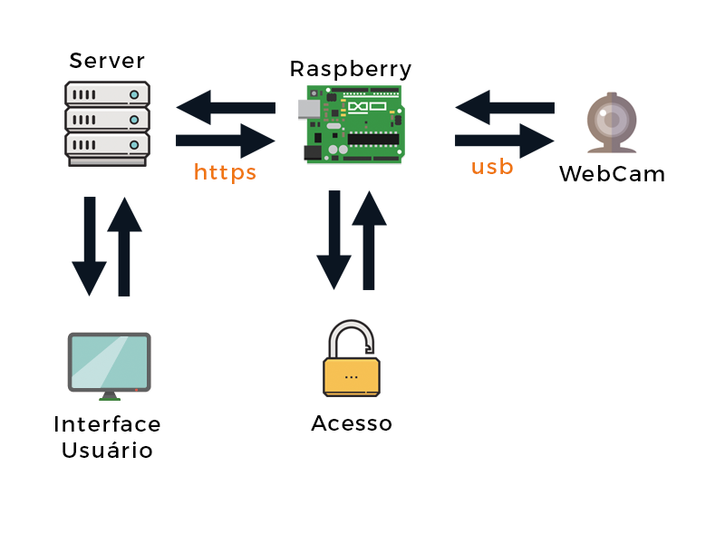

# User registration and authentication system using facial recognition with web interface

This project is proposed for the subject 'Ubiquitous Systems Projects' as the final semester work, the idea behind is to achieve a reasonable implementation of a web interface and embedded system based on raspberry pi for face recognition and release access.



## Getting Started

These instructions will get you a copy of the project up and running on your local machine for development and testing purposes. See deployment for notes on how to deploy the project on a live system.

These project is not in any means made for production or to be used in critical system, this is only for academic purposes and experience.The guide below will lead you to the installation for development testing, examples and a brief FAQ of the project.

## Components

Here you can see what are used on the project, some components as raspberry need to be the same (in order to work the instructions) but the server can be a linux or a windows hosting the application, the same goes for the webcam, any model with USB should do the work.

* Raspberry Pi 2
* Server to run
* Webcam
* Relay (to simulate the opening)

### Prerequisites

These are what you need to be able to use, you'll need install the following programs on the raspberry and server.

* Python 2.7
* Flask
* Angular
* Face Recognition
* MySQL Python
* OpenCV
* NumPy


### Installing

The guide is based for linux system but should be able to install on windows machines with proper adjustments and installers.

If you don't have python 2.7 installed, run the following command to install both python and pip version
```
sudo apt install python2.7 python-pip
```

To install Flask, simply write the follow command with pip
```
pip install Flask
```

For Angular visit the page and select the best suited option
```
https://angularjs.org/
```

For face_recognition visit [ageitgey tutorial page](https://gist.github.com/ageitgey/1ac8dbe8572f3f533df6269dab35df65) for walk through on how to install on Raspberry.

For MySQL-Python run the two commands following the order
```
sudo apt install default-libmysqlclient-dev

pip install MySQL-python
```

The last step to run is the following three commands that will take care of opencv and numpy

[compiler] 
```
sudo apt-get install build-essential
```
[required] 
```
sudo apt-get install cmake git libgtk2.0-dev pkg-config libavcodec-dev libavformat-dev libswscale-dev
```
[required] 
```
sudo apt-get install python-dev python-numpy libtbb2 libtbb-dev libjpeg-dev libpng-dev libtiff-dev libjasper-dev libdc1394-22-dev
```

## Contributing

The authors to this date do not intend to continue the project, any questions are welcome and will be answered as soon as possible.


## Authors

* **Ale Chaito** - [alechaito](https://github.com/alechaito)
* **Luan Lorenzo** - [luanr](https://github.com/luanr)
* **Luan Rodrigues** - [luanlorenzo](https://github.com/luanlorenzo)
* **Gabriel Domene** - [gabrieldomene](https://github.com/gabrieldomene)


## License

This project is licensed under the MIT License - see the [LICENSE.md](LICENSE.md) file for details

